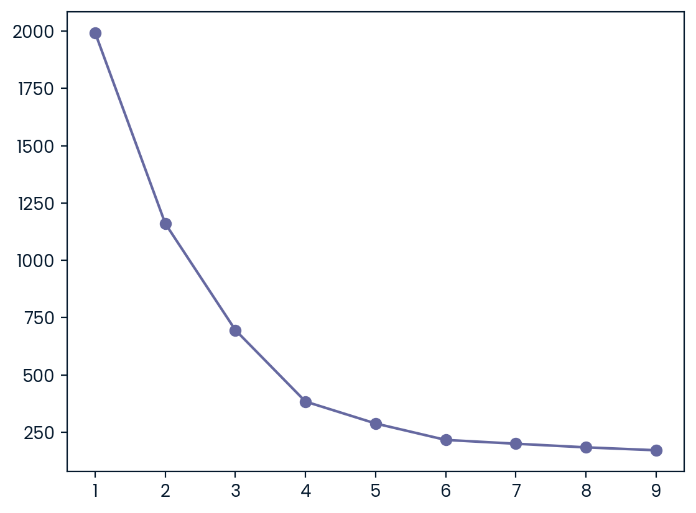
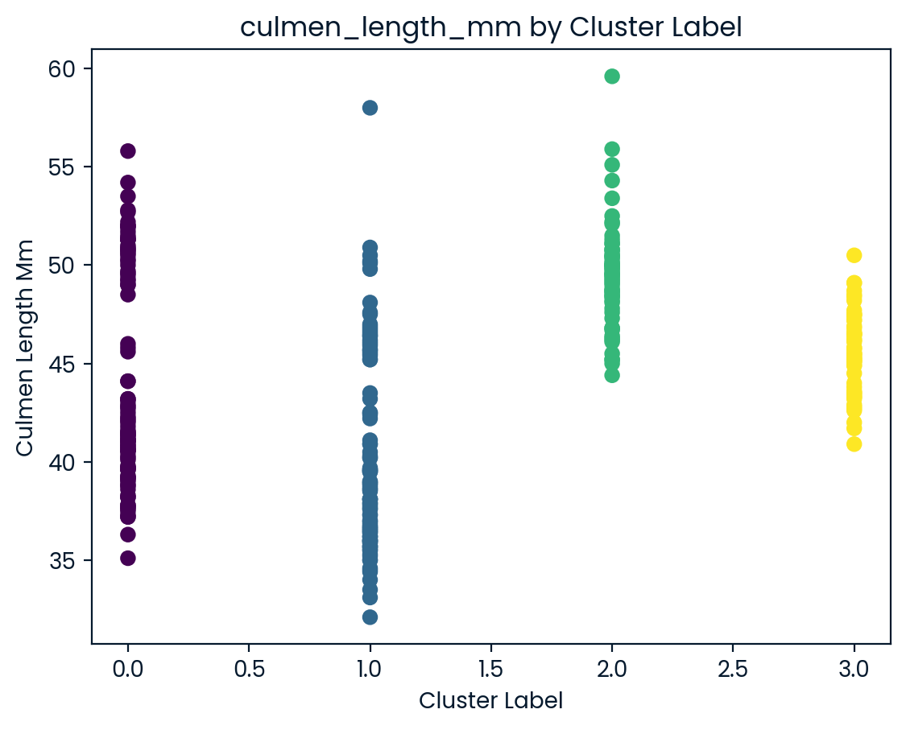
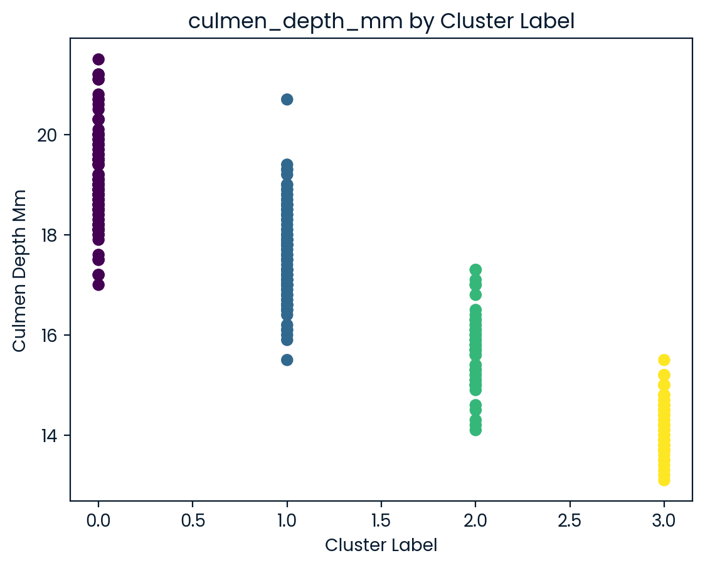
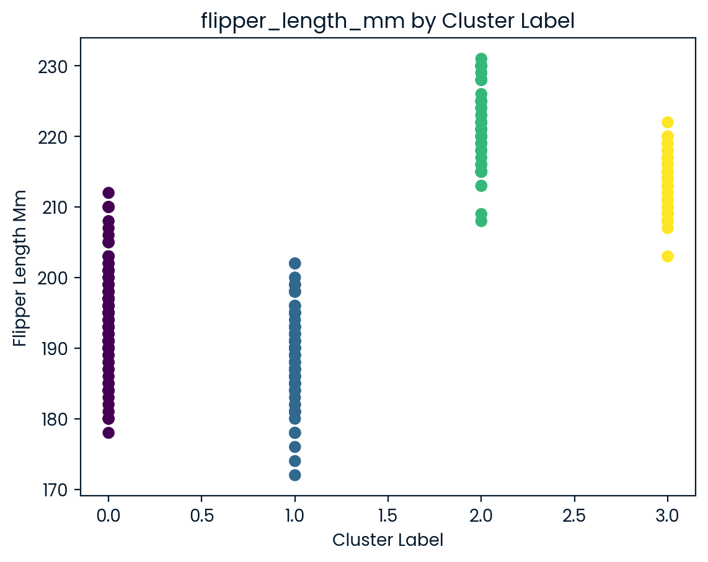
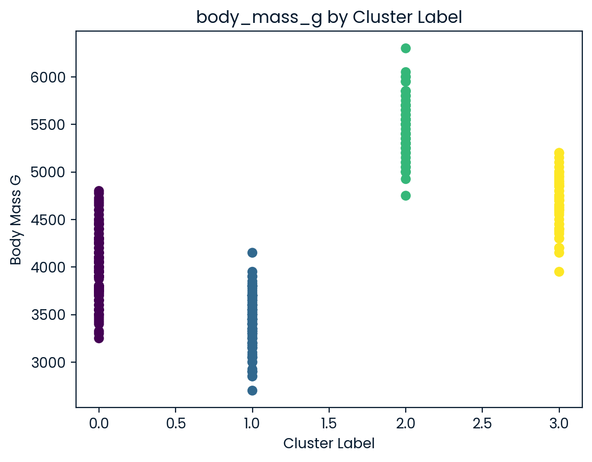

# Penguin Species Clustering

## Project Description

This project was created to support ecological researchers in identifying penguin species in Antarctica using unsupervised machine learning. Due to missing species labels in the dataset, clustering techniques were used to uncover natural groupings based on penguin body measurements.

By applying **K-Means Clustering** and visualizing results using **Principal Component Analysis (PCA)**, the project successfully revealed at least three distinct clusters that likely correspond to the known native species: Adelie, Gentoo, and Chinstrap.

The project demonstrates skills in:
- Exploratory Data Analysis (EDA)
- Feature engineering and scaling
- Unsupervised machine learning (K-Means)
- Dimensionality reduction (PCA)
- Data storytelling through visualization

It also highlights the practical application of data science in solving real-world biological and environmental challenges.

---

## Dataset

- **Source**: Dr. Kristen Gorman and the Palmer Station, Antarctica LTER
- **Access**: The CSV file (`penguins.csv`) is included in the `/data` folder.
- **Features Used**:
  - `culmen_length_mm`
  - `culmen_depth_mm`
  - `flipper_length_mm`
  - `body_mass_g`
  - `sex` (converted to numerical)

This dataset does not include species labels, which is why unsupervised learning was used to uncover natural clusters.

---

## Methods

- **Data Cleaning**: Removed missing values, converted categorical to numerical.
- **Standardization**: Used `StandardScaler` to normalize feature ranges.
- **K-Means Clustering**:
  - Applied Elbow Method to identify optimal `k` (expected: 3 species).
  - Clustered penguins into groups without using actual species labels.
- **PCA**: Reduced features to 2D for visual cluster separation.

---

## Visualizations

### Elbow Method for Optimal Clusters

### PCA Cluster Plot

### Culmen Length (mm) by Cluster

### Culmen Depth (mm) by Cluster

### Flipper Length (mm) by Cluster

### Body Mass (g) by Cluster

---

## Key Insights

- Although only 3 penguin species were expected (Adelie, Chinstrap, and Gentoo), clustering analysis suggests the presence of 4 distinct groups based on morphology.
- All four features — body mass, flipper length, culmen depth, and culmen length — show clear separation between cluster labels.
- This raises the possibility of a subspecies, data recording artifact, or behavioral variant among one of the known species.

---

## Tools Used
Python
pandas, numpy
seaborn, matplotlib
scikit-learn (KMeans, PCA)
Jupyter Notebook

## License
This project is for educational and portfolio purposes.
